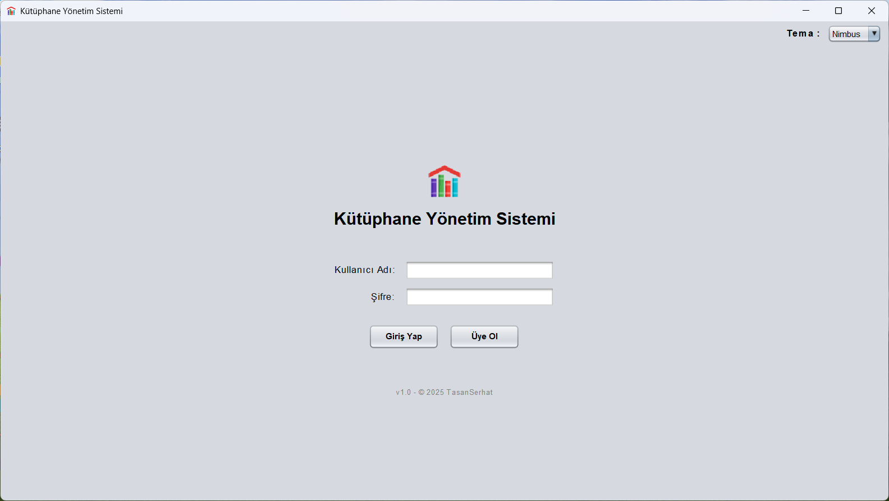
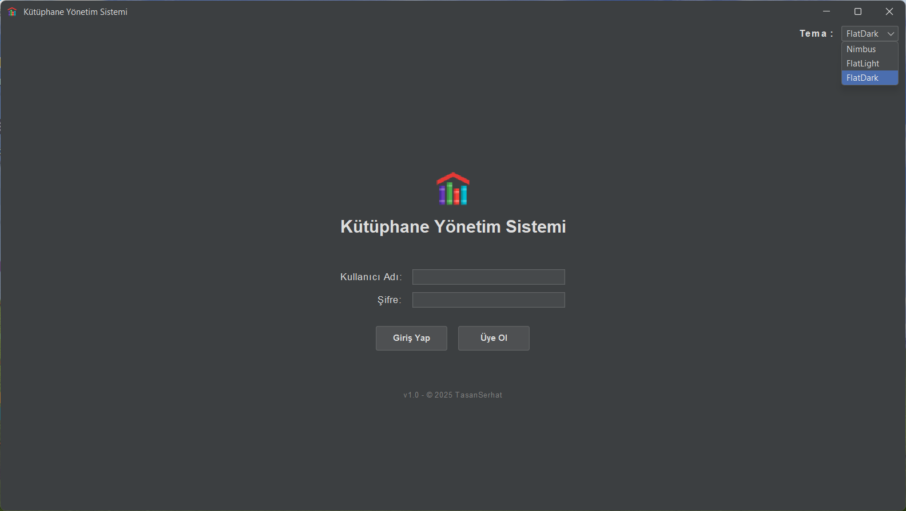
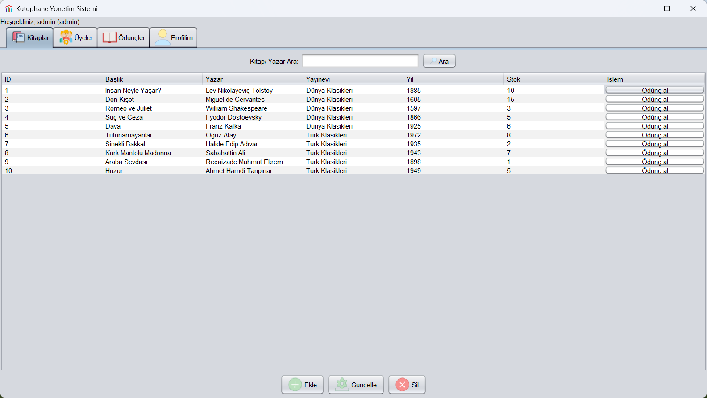
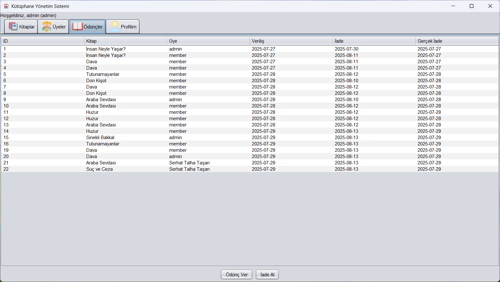
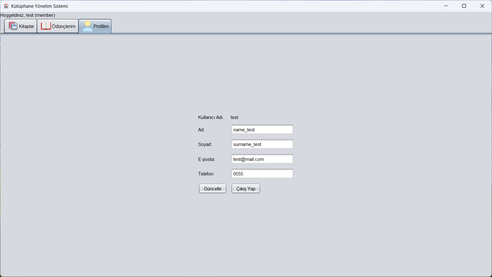

# 📚 Kütüphane Yönetim Sistemi

Java Swing ile geliştirilmiş, JDBC ve MySQL kullanan, modern ve kullanıcı dostu bir kütüphane yönetim sistemi.

## Özellikler
- Kitap, üye, ödünç işlemleri
- Giriş/kayıt ekranı, rol tabanlı yetkilendirme (admin/üye)
- Dinamik arama, satır içi butonlar, profil sekmesi
- Tema seçici (Nimbus, FlatLight, FlatDark)
- Modern arayüz (FlatLaf desteği)

## Kullanılan Teknolojiler

- Java 8
- Swing (UI)
- FlatLaf (Modern UI)
- JDBC (Veritabanı bağlantısı)
- MySQL

## Kurulum ve Gereklilikler
1. Java sürümü 8 olmalıdır
2. MySQL Server bilgisayarınızda kurulu ve çalışır durumda olmalıdır.
3. MySQL veritabanı sisteminde `library_db` adında bir veritabanı oluştur ve proje dizininde yer alan `library_db` SQL dosyasını içe aktar.
4. Proje dizininde yer alan "connection_config.properties" dosyasını metin belgesi ile açıp kendi MySQL bağlantınız için gerekli url, username ve password bilgilerinizi girin.
3. Uygulama iki türlü başlatılabilir :
	1. Herhangi bir java IDE'si ile proje import edilerek "Main" classın çalıştırılması ile.
	2. Proje dizininde yer alan "dist" klasörünün içinde "LibraryManagementSystem.jar" uygulamasının çalıştırılması ile. (Çalıştırmadan önce ayrıca bu klasörde yer alan "connection_config.properties" dosyasını kendi MySQL bağlantı bilgilerinizle değiştirmeyi unutmayın.)

## Test Hesapları

   1. Admin/(role-admin):
 	 Kullanıcı adı: admin
,
   	 Şifre: admin123
   3. Member/(role-member):
         Kullanıcı adı: member
,
         Şifre: member123

## Ekran Görüntüleri

## Katkı ve Lisans
Eğitim amaçlıdır.
